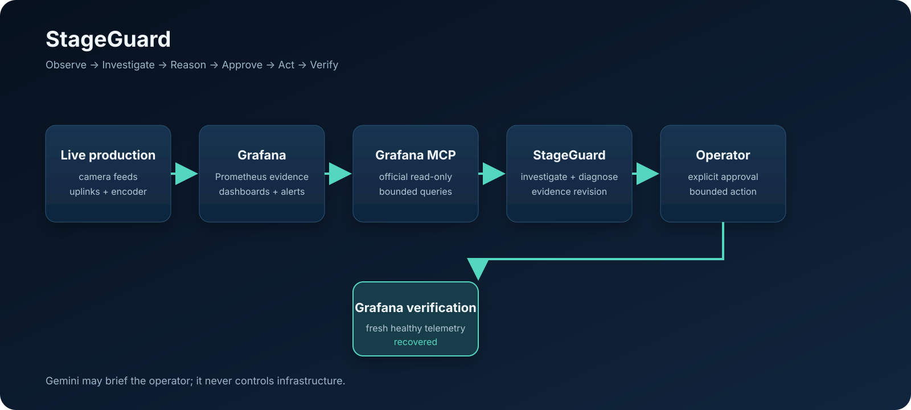

# StageGuard

**An agentic incident commander for live media production.**

StageGuard uses Grafana and the official Grafana MCP to investigate live production incidents, uses Gemini to brief operators, requires revision-bound human approval for consequential actions, and returns to Grafana telemetry to independently verify recovery.

**Observe → Diagnose → Approve → Act → Verify**

> Grafana is used twice: first to understand what failed, then to prove whether recovery actually happened. An action response is never treated as recovery.



## 60-second architecture

```text
Live Production Simulator
        ↓
Prometheus / Loki
        ↓
Grafana
        ↓
Official Grafana MCP (read-only)
        ↓
StageGuard evidence-grounded investigation
        ↓
Gemini operator briefing (advisory)
        ↓
Exact human approval
        ↓
Bounded remediation adapter
        ↓
Grafana telemetry verification
```

## Run the demo

On a Docker-capable machine:

```bash
python scripts/demo_release.py --open
```

The deterministic `broadcast-alpha` scenario starts healthy, injects packet loss on `uplink-b`, produces frame drops on `cam-3`, proves the official Grafana MCP read path, and leaves the operator at: **Investigate → Brief → Approve exact revision → Execute → Verify**.

See [DEMO.md](DEMO.md) for the recording sequence and [OPERATOR_CONSOLE.md](OPERATOR_CONSOLE.md) for the cockpit controls.

## Current executable vertical slice

```text
deterministic broadcast simulator
  → Prometheus + Loki + Grafana
  → official grafana/mcp-grafana
  → strict semantic telemetry mapping
  → metric + Loki preflight
  → expiring datasource/contract activation pins
  → six-read metric diagnosis
  → mandatory production Loki corroboration
  → authenticated IncidentService
  → optional evidence-revision-bound Gemini briefing
  → authenticated same-origin operator cockpit
  → evidence-revision-bound human approval
  → disabled-by-default allowlisted remediation
  → credential-isolated HTTPS write transport
  → Grafana/Prometheus recovery verification
  → bounded local JSONL or Google Cloud Logging audit
  → integrity-checked local or GCS incident lifecycle checkpoint
  → Cloud Run/IAP deployment + liveness/readiness/self-observability
```

The deterministic fixture models three camera feeds and two uplinks. Its seeded incident is specific: `cam-3` drops frames because `uplink-b` has severe packet loss while encoder CPU/GPU and peer paths remain healthy.

## Safety model

| Boundary | Policy |
|---|---|
| Grafana MCP | Read-only evidence credentials; infrastructure-write credentials are separate |
| Metric onboarding | Strict versioned mapping; exactly eight bounded semantic metric checks must resolve |
| Loki onboarding | One StageGuard-owned causal LogQL contract is preflighted; callers never supply LogQL |
| Activation | Metric profile + Prometheus datasource and Loki contract + Loki datasource are independently SHA-256 pinned and time bounded |
| Investigation | Six policy-selected metric reads must independently diagnose before Loki is queried |
| Loki corroboration | Missing, truncated, scope-drifted, or inconsistent logs force abstention |
| Gemini commander | Advisory only; exact current incident revision required; cannot change diagnosis, approval, remediation, or recovery state |
| Identity | Actor identity comes from a trusted provider, never request JSON; production IAP uses the verified signed JWT `sub` claim |
| Operator cockpit | Same-origin, authenticated, no browser secrets/persistence, strict CSP, dynamic values rendered as text |
| Approval | Explicit, single-use approval is bound to the exact incident evidence revision |
| Remediation | Production writes are disabled by default; enabled writes are allowlisted, idempotent, timeout/retry bounded, and credential isolated |
| Recovery | Action acceptance never means recovery; Grafana telemetry must prove consecutive healthy samples |
| Audit | Bounded lifecycle records preserve trusted actor plus non-secret activation/action/briefing provenance |
| Checkpoint | Restored state is schema/version/integrity/scope/revision checked; provider metadata is stripped; GCS writes use generation preconditions |

## Production onboarding and activation

Real productions can map their existing Prometheus metric and label names in `runtime/telemetry.example.json`; datasource IDs and raw PromQL/LogQL are intentionally not accepted in that mapping.

Before the live MCP preflight, run the dependency-free onboarding doctor:

```bash
python scripts/stageguard_doctor.py runtime/telemetry.example.json
```

It checks Python, the telemetry mapping, `GRAFANA_URL`, the least-privilege token-file path, and whether the configured official Grafana MCP launcher is available. It never reads or prints token contents, executes PromQL/LogQL, or mutates local/remote state. `--json` provides a machine-readable result for setup automation.

With least-privilege Grafana MCP credentials configured:

```bash
python runtime/preflight.py runtime/telemetry.example.json \
  --activation-output .stageguard/activation.json \
  --log-activation-output .stageguard/log-activation.json
```

The metric preflight executes the same six investigation reads and two recovery reads used at runtime. The Loki preflight executes the exact bounded causal query StageGuard later uses. Metric and Loki activation records pin the configured contracts/datasources and expire.

## Gemini boundary

`runtime/gemini_commander.py` sits above the deterministic evidence core. It does **not** receive remediation clients, credentials, endpoints, PromQL, LogQL, raw log bodies, arbitrary tools, or infrastructure write access. `IncidentService.briefing()` binds generation to the exact current `incident_id + revision`; Gemini remains disabled by default.

## Operator cockpit

`GET /console` is served by the same authenticated API process. The cockpit renders deterministic incident state, evidence revision, confidence, evidence slots, optional Gemini briefing, approval state, recovery outcome, and a bounded incident audit timeline. Approval requires typing the exact current revision and confirming explicitly. See `OPERATOR_CONSOLE.md`.

## Restart-safe incident state

Audit history and lifecycle state are intentionally separate. `runtime/incident_checkpoint.py` persists the current incident/revision/report, matching approval, bounded consumed outcome, and sequence in `stageguard.incident-checkpoint.v1`.

Local development uses an atomic owner-only JSON file under `.stageguard/`. For Cloud Run, set `STAGEGUARD_CHECKPOINT_BUCKET` to enable the durable GCS adapter. Without that variable the Cloud Run entrypoint explicitly selects no checkpoint backend rather than claiming ephemeral disk is durable. GCS updates use object-generation preconditions so competing writers fail instead of silently overwriting newer state.

A restored approval is accepted only when its evidence revision recomputes from the restored deterministic report and its action/production/target exactly match policy. A fresh investigation clears approval before persistence. A persisted outcome marks the approval consumed after restart. Provider remediation metadata/details are not persisted. See `INCIDENT_CHECKPOINTS.md`.

## Governed remediation

Production bootstrap uses `DisabledRemediationClient` unless writes are explicitly enabled. `runtime/production_remediation.py` owns the allowlisted policy and `runtime/http_remediation_transport.py` owns the credential-isolated HTTPS transport. Production operation IDs are deterministic and evidence-bound so an uncertain transport retry reuses the same idempotency identity.

The standard Cloud Run composition intentionally provides no environment flag that can enable production remediation.

## HTTP surfaces

Platform surfaces:

- `GET /healthz` — process liveness only
- `GET /readyz` — bounded evidence-plane readiness with activation revalidation and cached external MCP checks
- `GET /metrics` — fixed non-sensitive Prometheus-format StageGuard readiness telemetry

Authenticated operator surfaces:

- `GET /console`
- `GET /assets/operator.css`
- `GET /assets/operator.js`
- `GET /v1/incident`
- `GET /v1/audit?incident_id=...`
- `POST /v1/investigate`
- `POST /v1/briefing`
- `POST /v1/approve`
- `POST /v1/execute`

Request bodies cannot supply actor identity, PromQL, LogQL, datasource IDs, prompts, remediation action names, targets, endpoints, credentials, Cloud Logging filters, or checkpoint object locations.

## Local development

```bash
docker compose up --build -d
python runtime/bootstrap_grafana.py
python runtime/mcp_smoke.py
python runtime/preflight.py runtime/telemetry.example.json \
  --activation-output .stageguard/activation.json \
  --log-activation-output .stageguard/log-activation.json
```

Useful endpoints: simulator metrics `http://localhost:9108/metrics`, Prometheus `http://localhost:9090`, and Grafana `http://localhost:3000`.

## Repository structure

- `scripts/stageguard_doctor.py` — credential-safe local onboarding prerequisite checks
- `runtime/telemetry.py` — validated semantic metric mapping + query builders
- `runtime/onboarding.py` — strict profile loader + eight-slot metric preflight
- `runtime/activation.py` / `runtime/log_activation.py` — expiring metric/Loki activation pins
- `runtime/mcp_metric_client.py` / `runtime/mcp_log_client.py` — official Grafana MCP adapters
- `runtime/investigator.py` — deterministic diagnosis + fail-closed Loki correlation
- `runtime/gemini_commander.py` — bounded Gemini advisory boundary
- `runtime/incident_service.py` — lifecycle, revision-bound briefing/approval, audit/checkpoint boundary
- `runtime/incident_checkpoint.py` — local/GCS restart-state persistence
- `runtime/durable_audit_reader.py` / `runtime/cloud_audit.py` — bounded Cloud Logging audit read/write
- `runtime/identity.py` — local, static bearer, and verified Google IAP identity providers
- `runtime/operator_console.py` — authenticated same-origin cockpit
- `runtime/readiness.py` — activation-aware MCP readiness cache/backoff + metrics
- `runtime/bootstrap.py` / `runtime/cloudrun_entrypoint.py` — production composition roots
- `runtime/production_remediation.py` / `runtime/http_remediation_transport.py` — governed write path
- `runtime/remediation.py` — approval and Grafana-based recovery verification
- `runtime/api.py` — authenticated API and platform health surfaces
- `runtime/tests/` — credential-free regression coverage
